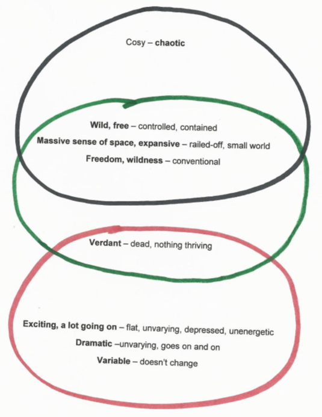

## Interpretive Clustering

This package accompanies the paper [Interpretive clustering](#) by [Burr, King, and Heckmann (forthcoming)](#). The authors describe a variant of construct clustering which uses a procedure from graph theory called [maxmimal cliques enumeration](https://en.wikipedia.org/wiki/Clique_problem#Listing_all_maximal_cliques). Given a similarity measure, in our case the number of matching scores between two constructs, a network graph of relatedness between constructs is construed.
A clique is a group of constructs which are all mutually related, given some cut-off criterion for relatedness (e.g. 6 matching scores in a grid with 7 elements). While an offline approach is also described to find the construct cliques, this software automates the process. Below you see the resulting cliques for Sylvia's sample grid. In the paper, the interpretation of the discovered cliques is discussed in detail.
                       

