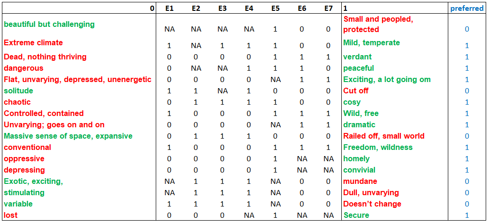

```{r setup, include=FALSE}
knitr::opts_chunk$set(echo = FALSE)
```

# Sample output

The results of the IC analysis are not displayed interactively but are bundled in an MS Excel file
that can be downloaded (see tab `Analysis`). The results of all intermediate IC steps
as described in [Burr, King, and Heckmann (2020)](https://doi.org/10.1080/14780887.2020.1794088) are
contained. The main purpose of the software is to automate the cluster identification step of the IC
procedure (see tab `Method`), which is a cumbersome and error-prone task if performed manually.
Below, an extract of the analysis results for Sylvia's grid are shown. For a more detailed epxlanation,
however, please refer to our publication.

## Input data and results

The input file for Sylvias's grid is available for download on the `Analysis` tab. Figure 1 shows the
raw grid data.

{width="60%"}

Figure 2 displayes the network graph of related contructs and discovered construct cliques, the most
relevant part of the output, which is subsequently used for interpretation in the next section.

{width="60%"}

## Interpretation

Psychologically relevant information can be obtained from the interpretation of the network graph in
Figure 2. What follows is a shortened example. More comprehensive examples are outlined in our
[publication](https://doi.org/10.1080/14780887.2020.1794088).

In the resulting diagram for Sylvia's grid in Figure 2, a construct is indicated by a circle, with
(+) denoting the preferred and (-) the non-preferred pole. The diagram shows three clusters (also
called cliques), indicated by the colored hulls around several constructs. In Sylvia's case, the
three clusters are highly overlapping. Two of these are of particular interest, sharing a 'core' of
three constructs -- '(+) Wild, free *vs* (-) controlled, contained', '(+) Massive sense of space,
expansive *vs* (-) railed-off, small world' and '(+) Freedom, wildness *vs* (-) conventional', with
(+) indicating the preferred and (-) the non-preferred pole. In one cluster, these three constructs
are strongly associated with '(+) Verdant *vs* (-) dead, nothing thriving'; the association between
her preferred poles suggests that she is drawn to places that are thriving and green, wild and
expansive, as opposed to those which lack life, are small-scale, controlled and conventional.
However, these three constructs share another cluster with the construct '(+) Cosy *vs* (-)
Chaotic', where 'cosy' is her preferred pole. In this cluster, however, her desires for the wild,
free and expansive appear to be in tension with her desire for the 'cosy', as they are aligned with
her non-preferred pole 'chaotic'. The attraction of wild, free spaces for Sylvia is therefore not
straightforward.

The third cluster includes the '(+) Verdant *vs* (-) dead, nothing thriving' construct, which is
here associated with '(+) Exciting, a lot going on *vs* (-) flat, unvarying, depressed,
unenergetic', '(+) Dramatic *vs* (-) unvarying, goes on and on' and '(+) Variable *vs* (-) doesn't
change'. This suggests that to Sylvia 'verdant' spaces are also full of excitement, drama and
variability- they are full of life in these ways. However, the fact that these three constructs do
not cluster with the wild/expansive/freedom constructs indicates that they constitute a somewhat
separate idea for her. A 'wild' space for her need not be 'exciting', for example, although a
'verdant' space is likely to be both exciting and wild. Interpretive clustering therefore gives us
insight into some of the complexity of Sylvia's construing.

```{r include=FALSE}
library(openxlsx)
library(OpenRepGrid.ic)

file <- system.file("extdata", "sylvia.xlsx", package = "OpenRepGrid.ic")
x <- read.xlsx(file)
s <- calculate_similarity(x, min_matches = 6)
```

## Underlying calculations

Also contained in the Excel ouput are the matrices generated in each step of the IC method. Some
details are explained on the `Method` tab. As an example, Table 1 shows the number of matches between constructs, with constructs reversal
beeing allowed. Thus, Construct 2 matches on three elements with Construct 1, on five elements with
Construct 3, on three elements with Construct 4, and so on.

*Table 1:* Number of matches between constructs.

```{r}
knitr::kable(s$R, table.attr = "style='width:60%;'")
```

The matrix of constructs relations is inferred from the matrix of construct matches, here, using a
minimum of 3 matches. The result is displayed in Table 2. A value of `1` denotes a positive, a value
of `-1` a negative construct relation. This matrix is used as a basis to build the network graph from
Figure 2.

*Table 2:* Relations between constructs.

```{r}
knitr::kable(s$D)
```
The examples above give a first insight into the generated output. Yet, to fully understand and work
with the output, it is recommended to consult [Burr, King, and Heckmann (2020)](https://doi.org/10.1080/14780887.2020.1794088) 
which outlines the IC method and gives a more thorough interpretation example. 
