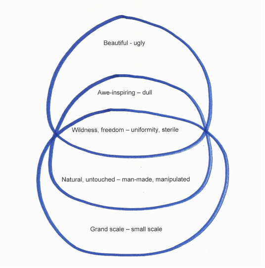

*Please see our publication for additional details*

On this page, we explain in detail the steps you need to follow in performing an Interpretive Clustering analysis on Repertory Grid data using a binary scoring method (for example ticks and crosses or 0s and 1s. We illustrate the steps using our own research. This was a Repertory Grid study of the meanings that ‘nature’ has for people. The constructs were elicited by asking participants to compare images (in triads) of a wide range of outdoor spaces.

### Step 1

It can simplify the early steps in the analysis if you number the constructs in each grid, so that you avoid having to enter the full construct titles at each stage.

### Step 2

First decide upon what you want to accept as an indication that one construct is related to another. We had 7 elements in our grids, and we agreed that two constructs must show identical responses on 5 out of the 7 constructs. This is a judgement that the researcher must make and defend. We felt that accepting fewer than 5 ‘matches’ would render the comparison too near to chance levels, but insisting on 6 or 7 matches might be so stringent as to eliminate potentially important relationships. We experimented with using both criteria in our research; accepting 5+ matches sometimes resulted in a great number of clusters for some participants, which were difficult to interpret. On the other hand, using only 6+ matches meant that, for some participants, no clusters were identified. There may be an argument for varying the criterion slightly between participants in order to simplify the clusters for participants where there is a great deal of interrrelatedness in their grid and to make sure you capture the interrelatedness for participants where it is much less pronounced but still evident.

### Step 3

In the case of each grid, produce a matrix showing the number of matches that each construct has with every other construct. This entails comparing each construct with every other construct in the grid and counting, for each construct pair, the number of elements where there is an identical response, i.e. where the elements are placed at the same pole of both constructs. Fig. 1 shows the matrix for one of our participants, Richard, as an example. Just the construct numbers, rather than full construct titles, have been used; we elicited 17 constructs with Richard.

**Fig. 1 Richard’s matrix**

|    | C1 | C2 | C3 | C4 | C5 | C6 | C7 | C8 | C9 | C10 | C11 | C12 | C13 | C14 | C15 | C16 | C17 |
|:---|:--:|:--:|:--:|:--:|:--:|:--:|:--:|:--:|:--:|:---:|:---:|:---:|:---:|:---:|:---:|:---:|:---:|
|C1  | *  | 3  | 2  | 2  | 2  | 2  | 3  | 2  | 2  |  2  |  2  |  1  |  1  |  2  |  2  |  2  |  1  |
|C2  | 3  | *  | 5  | 3  | 5  | 4  | 5  | 4  | 5  |  4  |  4  |  3  |  3  |  4  |  4  |  5  |  2  |
|C3  | 2  | 5  | *  | 3  | 6  | 6  | 5  | 6  | 6  |  6  |  6  |  5  |  5  |  5  |  5  |  6  |  4  |
|C4  | 2  | 3  | 3  | *  | 2  | 3  | 4  | 3  | 2  |  3  |  3  |  2  |  2  |  2  |  2  |  2  |  2  |
|C5  | 2  | 5  | 6  | 2  | *  | 5  | 5  | 5  | 6  |  5  |  5  |  4  |  4  |  5  |  5  |  6  |  3  |
|C6  | 2  | 4  | 6  | 3  | 5  | *  | 4  | 5  | 5  |  5  |  5  |  4  |  4  |  4  |  4  |  5  |  3  |
|C7  | 3  | 5  | 5  | 4  | 5  | 4  | *  | 6  | 5  |  6  |  6  |  3  |  3  |  5  |  5  |  5  |  2  |
|C8  | 2  | 4  | 6  | 3  | 5  | 5  | 6  | *  | 5  |  7  |  7  |  4  |  4  |  5  |  5  |  5  |  3  |
|C9  | 2  | 5  | 6  | 2  | 6  | 5  | 5  | 5  | *  |  5  |  5  |  4  |  4  |  5  |  5  |  6  |  3  |
|C10 | 2  | 4  | 6  | 3  | 5  | 5  | 6  | 7  | 5  |  *  |  7  |  4  |  4  |  5  |  5  |  5  |  3  |
|C11 | 2  | 4  | 6  | 3  | 5  | 5  | 6  | 7  | 5  |  7  |  *  |  4  |  4  |  5  |  5  |  5  |  3  |
|C12 | 1  | 3  | 5  | 2  | 4  | 4  | 3  | 4  | 4  |  4  |  4  |  *  |  5  |  3  |  3  |  4  |  4  |
|C13 | 1  | 3  | 5  | 2  | 4  | 4  | 3  | 4  | 4  |  4  |  4  |  5  |  *  |  3  |  3  |  4  |  4  |
|C14 | 2  | 4  | 5  | 2  | 5  | 4  | 5  | 5  | 5  |  5  |  5  |  3  |  3  |  *  |  5  |  5  |  2  |
|C15 | 2  | 4  | 5  | 2  | 5  | 4  | 5  | 5  | 5  |  5  |  5  |  3  |  3  |  5  |  *  |  5  |  2  |
|C16 | 2  | 5  | 6  | 2  | 6  | 5  | 5  | 5  | 6  |  5  |  5  |  4  |  4  |  5  |  5  |  *  |  3  |
|C17 | 1  | 2  | 4  | 2  | 3  | 3  | 2  | 3  | 3  |  3  |  3  |  4  |  4  |  2  |  2  |  3  |  *  |

The figures in the table represent the number of elements for which each pair of constructs matches. Thus, Construct 1 matches on four elements with Construct 2, zero elements with Construct 3, six elements with Construct 4, and so on.

In our research, we used ticks and crosses as the scoring system. ‘Matches’ can be either two ticks or two crosses (since ‘0’ means that the construct can’t meaningfully be applied to that element- the element is ‘out of range of convenience’ of that construct- it would not make sense to count two 0s as a ‘match’). It is important to recognise that constructs may be negatively related, such that the preferred pole of one construct is related to the non-preferred pole of another. It is important to capture these negative relationships as well as the positive ones, since these can indication tensions and contradictions within the person’s construing. So in inspecting the construct pairs you should also identify any pair where there were instances of this (ie a tick against an element for one construct and a cross for the other). In the case of our research, we looked for cases where there were 5 or more mis-matches, ie. 2 or fewer ‘matches’. Fig. 2 illustrates this by comparing the patterns of responses on two constructs from the grids for Richard and Pamela, another participant.

**Fig. 2 Relationships between two constructs for Pamela and Richard.**

*Comparing two of Pamela’s constructs*

 Construct no.     Preferred pole ✔   C4    C6    A4    A1    B1    A6    C5   Non-preferred pole ✘  
--------------  -------------------  ----  ----  ----  ----  ----  ----  ----  ----------------------
             1    wildness, freedom   ✘     ✔     ✔     ✔     ✔     o     ✘    uniformity, sterile   
            12   natural, untouched   ✘     ✘     ✔     ✔     ✔     o     ✘    man-made, manipulated 

*Comparing two of Richard’s constructs*

 Construct no.   Preferred pole ✔   C4    C6    B2    B1    C1    C5    C3   Non-preferred pole ✘ 
--------------  -----------------  ----  ----  ----  ----  ----  ----  ----  ---------------------
             8         changeable   ✘     ✘     ✔     ✔     ✔     ✘     ✘    fixed                
            16            my life   ✔     ✔     ✔     ✘     ✘     ✘     ✔    alien                

Pamela’s constructs are positively related because they ‘agree’ on 5 out of 7 elements. Richard’s constructs are negatively related because there are ‘disagreements’ on 5 out of 7 elements.

### Step 4
The next step is to create a list, for each of a participant’s constructs, of all the other constructs with which it has the requisite number of either positive or negative matches- in our case, 5 or more. Fig. 3 shows the lists of construct matches for three of Pamela’s fifteen constructs as an example.

**Fig. 3 For three of Pamela’s constructs, all the constructs related to them are listed.**

***Wildness, freedom - uniformity, sterile***

- *Awe-inspiring – dull*
- *Beautiful – ugly*
- *Natural, untouched – man made, manipulated*

***Has movement, vibrant – dismal, static***

- *Wildness, freedom - uniformity, sterile*
- *Uplifting – depressing*
- *Feel at ease – threatening*
- *Energising – energy sapping*

***Natural, untouched – man made, manipulated***

- *Wildness, freedom - uniformity, sterile*
- *Grand scale – small scale*
- *Awe-inspiring – dull*

### Step 5

Next, identify clusters of constructs from each of the construct lists compiled in Step 4. What counts as a ‘cluster’ is open to researcher discussion and agreement- in our research we decided that a cluster was a group of at least 3 constructs that were all related to each other, ie they all had 5 or more matches with each of the other elements in the cluster. This is done by checking each construct in a list against every other one in that list and retaining only those that are related to the others. Bear in mind that one list may generate several possible clusters involving different combinations of constructs. This is done for every construct list until all possible clusters are identified.

### Step 6

The process described in Step 5 inevitably produces replications and overlaps. You should therefore examine all the clusters identified from a grid and eliminate any that are identical or where all the constructs in one cluster are already contained within another, larger cluster. The remaining construct clusters are then recorded as all the clusters for that participant. Fig. 4 shows the clusters for Pamela.

**Fig. 4 Pamela’s clusters**

**Cluster 1**

- *Wildness, freedom - uniformity, sterile*
- *Awe-inspiring – dull*
- *Natural, untouched – man made, manipulated*

**Cluster 2**

- *Wildness, freedom - uniformity, sterile*
- *Awe-inspiring – dull*
- *Beautiful - ugly*

**Cluster 3**

- *Wildness, freedom - uniformity, sterile*
- *Natural, untouched – man made, manipulated*
- *Grand scale – small scale*

**Cluster 4**

- *Friendly – lonely*
- *Busy – quiet*
- *Safe – dangerous to humans*

**Cluster 5**

- *Uplifting – depressing*
- *Has movement, vibrant – dismal, static*
- *Energising – energy sapping*

As you can see, there are two clusters involving the constructs ‘Wildness, freedom - uniformity, sterile’ and ‘Awe-inspiring – dull’, overlapping partially with two clusters involving ‘Wildness, freedom - uniformity, sterile’ and ‘Natural, untouched – man made, manipulated’. There are a further two clusters that do not share constructs with any other cluster. Fig. 5 is a way of visually representing these relationships and overlaps how they are related to each other, which is rather like a Venn diagram.

**Fig. 5 Pamela’s clusters expressed schematically**

### Next steps

This is where the interpretive work begins. Some questions to guide your interpretation could include:

1. How many constructs were elicited for the participant?
2. How many clusters are there?
3. What degree of overlap is there between the clusters?
4. How many of the participant’s constructs appear in at least one cluster?
5. Are there any inverted relationships between clusters, such that the preferred pole of one construct matches the contrast pole of another?

The number of constructs will give an indication of how rich or, in PCP terms, highly elaborated the topic area is for that person. The number of constructs appearing in clusters and the degree of overlap between the clusters indicate how much interrelatedness there is in the person’s construing of the topic area. A large number of constructs appearing in clusters, and several overlapping clusters, would indicate that many of the person’s constructs for the topic area are closely bound up with each other, implicating them in the person’s meaning-making; having large clusters and/or a high degree of overlap between clusters suggests constellatory construing.

You could then use your answers to these questions to prepare narrative summaries for each participant, drawing out the meaning of their clusters by looking back at their interview transcript and using quotes from this to illustrate your summary. You could comment on how interrelated or separate their constructs are and what you think this means, and also comment on where there are any negative relationships that might indicate tensions or contradictions in the person’s construing. Remember that construct clusters are not the same as themes; constructs that are clustered together are not different instances of the same thing. Constructs that are clustered together are related because if an element (thing, person or event) is given meaning through one of the constructs it will also derive meaning from other constructs in the cluster.
