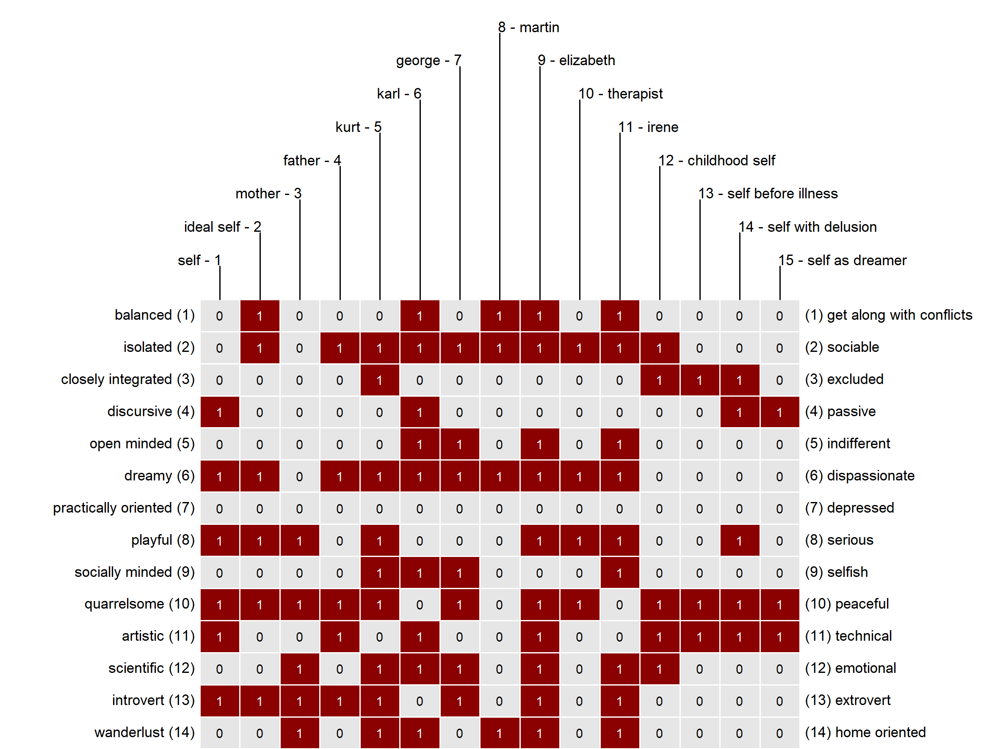
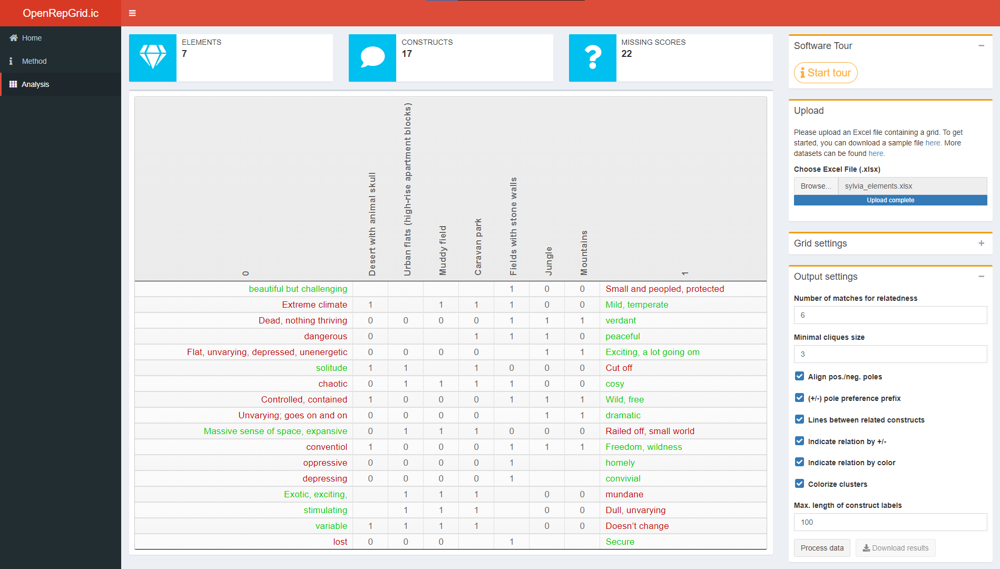
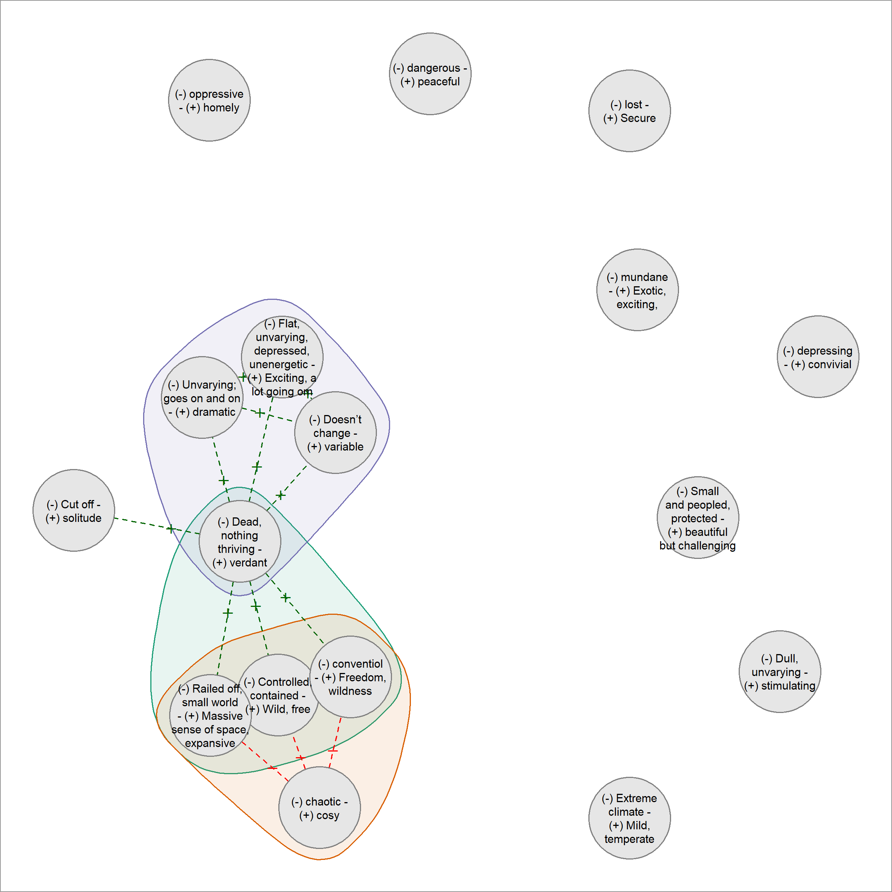

<style type="text/css">
code.r{
  font-size: 12px;
}
pre {
  font-size: 12px
}
</style>


```{r setup, include=FALSE}
knitr::opts_chunk$set(echo = TRUE, comment = "")
options(width = 200)
library(OpenRepGrid)
```

  
# Introduction

The [repertory grid technique](https://en.wikipedia.org/wiki/Repertory_grid) (often abbreviated as *grid* or *repgrid*) is a person-centered data collection method. It is primarily used in clinical psychology and generates a mix of qualitative and quantitative data. The [`OpenRepGrid.ic` R package](https://cran.r-project.org/web/packages/OpenRepGrid.ic/index.html) presented here is a browser-based software to perform *Interpretive Clustering* (IC) for such data. IC is a method for clustering the attributes (so called constructs) resulting from a repertory grid interview by finding relational patterns between them. The IC method is described in detail in our recent publication [[@burr_qualitative_2020]](https://doi.org/10.1080/14780887.2020.1794088). The package is part of the [OpenRepgrid project](http://openrepgrid.org/), which contains several software packages for the analysis of repertory grid data. In the following, we will briefly describe the repertory grid technique and provide a short example of how a grid dataset can be analyzed and interpreted using our [`OpenRepGrid.ic`](https://cran.r-project.org/web/packages/OpenRepGrid.ic/index.html) software. 


# Statement of need 

Currently, the IC method is not implemented in any other existing repertory grid software. While IC can also be conducted by hand, this is very time consuming, error-prone and only feasible for small-sized grids. Hence, a software solution to support the IC procedure is needed. Without proper software support that facilitates the IC steps, the  method is too laborious and is thus likely to become a methodological contribution which will rarely be used in research due to above mentioned reasons.


# Repertory Grid Technique 

The repertory grid technique (RGT) is a method which originated from *Personal Construct Theory (PCT)* [@kelly_psychology_1955]. It was originally designed as an instrument for clinical psychology but quickly spread to other disciplines like marketing, political, organizational, and educational research in the decades after its inauguration [@fransella_manual_2004]. The RGT is a person-centered method which focuses on understanding how an individual sees, or in constructivist terms *construes*, the world. The data collected by the RGT is both, *qualitative* and *quantitative*. The qualitative part of the data consists of a list of bipolar attributes (e.g. *light-hearted vs. depressed*), which are elicited during the repertory grid interview. These attributes are called *constructs* in PCT terminology. Each construct consists of two *poles*, e.g. *light-hearted* and *depressed*, with the poles usually being opposites. In PCT, the constructs constitute the templates a person uses to construe a set of objects under consideration. These objects are called *elements* in PCT terminology and are, for example, persons, brands, countries, companies etc. In our example in Figure 1, the elements are a set of persons relevant to the grid interviewee, for example, *father*, *mother*, *self*, or *ideal self*. The quantitative part of a grid is generated by letting the interviewee assign a score (e.g. 0/1, or 1 to 6) to each element on each of his/her bipolar constructs. The result of the RGT is usually displayed as a constructs *x* elements matrix with the cells containing the ratings of each element on each construct. Figure 1 shows a grid matrix where binary ratings (0/1) were used to assess the elements. For example, the element *father* received a score of 1 on the *isolated = 0 vs. sociable = 1* construct, indicating that the father is construed as sociable. The *mother*, in contrast, received a score of 0 and is thus construed as isolated. The grid matrix is the central result of the RGT and yields a) a set of bipolar constructs which are relevant to the person and b) an assessment of each element (persons in Figure 1) on these dimensions. The white/red color coding in Figure 1 additionally indicates which construct poles (white = left, red = right) apply and facilitates to identify similarities between elements. In its original form [@kelly_psychology_1955] and in our example, grid ratings are binary (0/1), i.e., each element is assigned to one construct pole. Nowadays, also scales with more grades (e.g. 1 to 6) are common. A general and more comprehensive introduction to the RGT can be found in @fransella_manual_2004.

{ width=90% }


# Interpretive Clustering

IC is an idiographic method of interpretation which makes use of both, the qualitative and the quantitative grid data. In contrast to thematic analysis or content analysis, which could be used to identify themes in person's elicited constructs [see @braun_using_2006], IC identifies the relation between the constructs via quantitative assessment. By assessing the quantitative construct relations, implications which constructs hold for each other are identified. IC essentially identifies clusters of constructs which hold implications for each other. These clusters (or cliques) of constructs form the basis for a subsequent qualitative interpretation. We will provide a brief interpretation example below. The example builds on the analysis results the software generates as shown next. However, for a more thorough introduction to the IC method and comprehensive illustrations of interpretations, the reader is referred to our publication [[@burr_qualitative_2020]](https://doi.org/10.1080/14780887.2020.1794088). Please note that the IC method only allows for binary grid ratings.


# Running the software

The package can be downloaded from the CRAN repository via the R command `install.packages("OpenRepGrid.ic")`. The software is then started as follows.

```{r eval=FALSE}
library(OpenRepGrid.ic)
ic()
```

Also, a docker image is provided under https://hub.docker.com/repository/docker/markheckmann/openrepgrid.ic with a short instruction how to run the app locally. A screenshot of the user interface is displayed in Figure 2. The image shows a grid dataset from an interview with *Sylvia* which is also contained in the package.



The results of the IC analysis are not displayed interactively but are included in an MS Excel file that can be generated and downloaded. Also the results of the intermediate IC steps as described in [Burr, King, and Heckmann (2020)](https://doi.org/10.1080/14780887.2020.1794088) are contained. The main purpose of the software is to automate the cluster identification step of the IC procedure, which is a cumbersome and error-prone task if performed manually. In Figure 3, an extract of the analysis results for Sylvia's grid and corresponding analysis settings as shown in Figure 2 are displayed and subsequently discussed.  

{ width=90% }


# Interpretation

Psychologically relevant information can be obtained from the interpretation of the network graphs. What follows is a shortened example. More comprehensive examples are outlined in our publication.

In the resulting diagram for Sylvia's grid in Figure 3, a construct is indicated by a circle, with (+) denoting the preferred and (-) the non-preferred pole. The diagram shows three clusters (also called cliques), indicated by the colored hulls around several constructs. In Sylvia's case, the three clusters are highly overlapping. 
Two of these are of particular interest, sharing a ‘core’ of three constructs – ‘(+) Wild, free *vs* (-) controlled, contained’, ‘(+) Massive sense of space, expansive  *vs* (-) railed-off, small world’ and ‘(+) Freedom, wildness *vs*  (-) conventional’, with (+) indicating the preferred and (-) the non-preferred pole. In one cluster, these three constructs are strongly associated with ‘(+) Verdant *vs* (-) dead, nothing thriving’; the association between her preferred poles suggests that she is drawn to places that are thriving and green, wild and expansive, as opposed to those which lack life, are small-scale, controlled and conventional. However, these three constructs share another cluster with the construct ‘(+) Cosy *vs* (-) Chaotic’, where ‘cosy’ is her preferred pole. In this cluster, however, her desires for the wild, free and expansive appear to be in tension with her desire for the ‘cosy’, as they are aligned with her non-preferred pole ‘chaotic‘. The attraction of wild, free spaces for Sylvia is therefore not straightforward. 

The third cluster includes the ‘(+) Verdant *vs* (-) dead, nothing thriving’ construct, which is here associated with ‘(+) Exciting, a lot going on *vs* (-) flat, unvarying, depressed, unenergetic’, ‘(+) Dramatic *vs* (-) unvarying, goes on and on’ and ‘(+) Variable *vs* (-) doesn’t change’. This suggests that to Sylvia ‘verdant’ spaces are also full of excitement, drama and variability- they are full of life in these ways. However, the fact that these three constructs do not cluster with the wild/expansive/freedom constructs indicates that they constitute a somewhat separate idea for her. A ‘wild’ space for her need not be ‘exciting’, for example, although a ‘verdant’ space is likely to be both exciting and wild. Interpretive clustering therefore gives us insight into some of the complexity of Sylvia’s construing.


# Contributing

In order to maximize the package's usefulness for the research community, we welcome participation in the package's development. Experienced R programmers are asked to make pull requests to the [`OpenRepGrid.ic` github repository](https://github.com/markheckmann/OpenRepGrid.ic), [report issues](https://github.com/markheckmann/OpenRepGrid.ic/issues), or commit code snippets. Non-technical oriented researchers are invited to send us feature requests or suggestions for improvement.


# References


